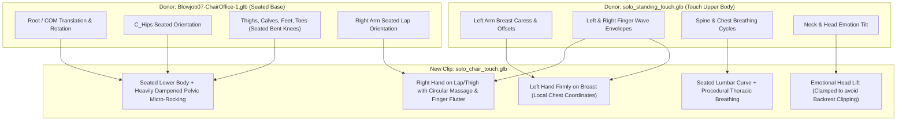

# Technical Analysis: Solo Furniture Animation (`solo_chair_touch`) for OSF Autonomous

## Executive Summary

This analysis evaluates the creation of a **solo furniture animation** (seated on a chair) for the OSF Autonomous framework by extracting structural seating kinematics from existing Gergel Ebanex (GE) paired chair animations and synthesizing them with the procedural upper-body touch and caress mechanics established in [`modify_standself01.py`](file:///G:/Starfield/StarfieldDev/src/OSFAutonomous/modify_standself01.py) and [`solo_standing_touch.glb`](file:///G:/Starfield/Data/OSF/Autonomous/Animations/solo_standing_touch.glb).

---

## 1. Recommended Approach & Justification

### Evaluation of Options

| Option | Architecture | Feasibility | Strengths | Weaknesses |
| :--- | :--- | :--- | :--- | :--- |
| **Option A** | Extract seated clip from GE $\rightarrow$ Import to Blender $\rightarrow$ Replace arm/hand channels with touch movements $\rightarrow$ Export via `sf_animation_io` | High | Immediate 3D visual feedback for armrest clearances, chest contact, and foot-to-floor alignment. | Manual process; difficult to maintain and batch across multiple chair types; risk of loop seam discrepancies. |
| **Option B** | Programmatic GLB Channel Transplantation & Procedural Blending via Python | **Highest (Primary)** | 100% automated, mathematically precise, repeatable, and preserves the clean 128-node female skeleton. | Lacks real-time visual viewport during computation; requires visual verification. |
| **Option C** | Build entirely new seated animation from scratch in Blender using reference `.af` files | Very Low | Total artistic freedom. | Labor-intensive (days of work); high probability of unnatural motion, loop pops, and rigging inconsistencies. |

### Verdict: Hybrid Pipeline (Option B Engine + Option A QA)
**Option B is recommended as the core generation engine**, supported by **Option A for visual QA and micro-tuning**.

1. **Exact 20.0-Second Loop Match**: Both [`solo_standing_touch.glb`](file:///G:/Starfield/Data/OSF/Autonomous/Animations/solo_standing_touch.glb) (480 frames at 24 fps) and the target GE seated donor clip [`Blowjob07-ChairOffice-1.glb`](file:///G:/Starfield/Data/SAF/Animations/GE/ChO/Blowjob07-ChairOffice-1.glb) (481 frames at 24 fps) are **exactly 20.00 seconds** in duration. All existing procedural Fourier harmonics in [`modify_standself01.py`](file:///G:/Starfield/StarfieldDev/src/OSFAutonomous/modify_standself01.py) ($60\pi$ finger flutter, $14\pi$ arm caress, $10\pi$ breathing cycles) map 1:1 onto the donor's timeline without time-stretching or interpolation artifacts.
2. **Skeleton Sanitization**: [`Blowjob07-ChairOffice-1.glb`](file:///G:/Starfield/Data/SAF/Animations/GE/ChO/Blowjob07-ChairOffice-1.glb) contains 204 nodes (including male face bones, penis bones `C_Penis_01..06`, and `Naked_M:0Er` mesh references). In contrast, [`solo_standing_touch.glb`](file:///G:/Starfield/Data/OSF/Autonomous/Animations/solo_standing_touch.glb) contains the clean 128-node female humanoid skeleton (including `C_Waist`). Starting from [`solo_standing_touch.glb`](file:///G:/Starfield/Data/OSF/Autonomous/Animations/solo_standing_touch.glb) as the base container and grafting lower-body rotation/translation tracks from GE preserves rig integrity and prevents male mesh pollution.
3. **Multi-Furniture Scalability**: A programmatic script can instantly generate variants for `ChairOffice`, `LodgeChair`, `ChairLeather`, and `ShipChairC` by swapping translation anchor parameters in milliseconds.

---

## 2. Source GE Scene & Clip Identification

### Analysis of Actor Roles (`-1` vs `-2`)

In OSF manifests, the `clips` array maps 1:1 to the `roles` array (`roles: ["m", "f"]`):
- `Clip -1` corresponds to Role `m` (Index 0).
- `Clip -2` corresponds to Role `f` (Index 1).

Across the GE chair animation catalog, the seated actor varies depending on scene choreography:

| Category | Scene Name | Clip `-1` Role & Posture | Clip `-2` Role & Posture | Seated Actor Clip |
| :--- | :--- | :--- | :--- | :--- |
| **Type-A** | [`Blowjob07`](file:///G:/Starfield/Data/SAF/Animations/GE/ChO/Blowjob07-ChairOffice-1.glb) | **Male: Seated upright** ($Z=0.67\text{m}$, leg $var=0.0005$) | Female: Kneeling on floor ($Z=0.44\text{m}$) | **Clip `-1`** |
| **Type-A** | [`Blowjob21`](file:///G:/Starfield/Data/SAF/Animations/GE/ChO/Blowjob21-ChairOffice-1.glb) | Male: Standing ($Z=1.22\text{m}$) | Female: Seated ($Z=0.66\text{m}$, 449 frames) | Clip `-2` |
| **Type-B** | [`Cowgirl05`](file:///G:/Starfield/Data/SAF/Animations/GE/ChO/Cowgirl05-ChairOffice-1.glb) | Male: Seated ($Z=0.73\text{m}$, active hip motion) | Female: Straddling atop male ($Z=0.81\text{m}$) | Clip `-1` (Active/Occupied) |
| **Type-C** | [`Missionary06`](file:///G:/Starfield/Data/SAF/Animations/GE/ChO/Missionary06-ChairOffice-1.glb) | Male: Standing/leaning ($Z=0.95\text{m}$) | Female: Reclined flat on seat ($Z=0.64\text{m}$, rot $128^\circ$) | Clip `-2` (Awkward recline) |
| **Type-D** | [`Standing11`](file:///G:/Starfield/Data/SAF/Animations/GE/ChO/Standing11-ChairOffice-1.glb) | Male: Standing near chair ($Z=1.04\text{m}$) | Female: Standing near chair ($Z=1.06\text{m}$) | Neither (Both standing) |
| **Type-E** | [`PowerBomb01`](file:///G:/Starfield/Data/SAF/Animations/GE/ChO/PowerBomb01-ChairOffice-1.glb) | Male: On floor ($Z=0.30\text{m}$) | Female: Seated leaned back $64^\circ$ ($Z=0.63\text{m}$) | Clip `-2` |

### Recommended Donor Clip: Type-A (`Blowjob07-ChairOffice-1.glb`)
**Specific Clip**: [`SAF/Animations/GE/ChO/Blowjob07-ChairOffice-1.glb`](file:///G:/Starfield/Data/SAF/Animations/GE/ChO/Blowjob07-ChairOffice-1.glb)
- **Pose**: Calm, natural upright seating posture ($10.1^\circ$ backrest recline).
- **Leg Stability**: Leg rotation variance is virtually zero ($0.0005$ for thighs, $0.000006$ for calves), providing a rock-solid, motionless lower body baseline.
- **Timing**: 481 frames at 24.0 fps = **20.00 seconds** (identical to [`solo_standing_touch.glb`](file:///G:/Starfield/Data/OSF/Autonomous/Animations/solo_standing_touch.glb)).
- **Compatibility**: Starfield humanoid skeletons are unisex. Retargeting this seated lower-body pose onto a female actor works seamlessly in OSF.

---

## 3. Kinematic Breakdown & Channel Extraction



### Channel Decomposition Matrix

| Bone Node | Source | Transformation Strategy | Technical Justification |
| :--- | :--- | :--- | :--- |
| `Root` | Static | `T=(0, 0, 0)`, `R=(0, 0, 0, 1)` | Locked to furniture origin. Zero drift. |
| `COM` | GE Seated | `T=(0.007, 0.1813, 0.6747)`, `R=(0.0884, -0.0016, 0.0178, 0.9959)` | Defines chair seat height ($Z=0.675\text{m}$) and seat depth ($Y=0.181\text{m}$). |
| `C_Hips` | GE Seated + Dampened Procedural | `T=(0, -0.224, -0.009)`, Seated base `R=(-0.691, -0.150, 0.691, 0.150)` | **Dampen hip sway by 75-80%**: Seated hips are constrained by the seat cushion. Pitch reduced from $\pm 2.0^\circ \rightarrow \pm 0.4^\circ$; lateral roll reduced from $\pm 0.3^\circ \rightarrow \pm 0.08^\circ$. |
| `R_Thigh`, `L_Thigh` | GE Seated | Full track replacement | Horizontal forward thigh elevation (~$90^\circ$ flexed from standing). |
| `R_Calf`, `L_Calf` | GE Seated | Full track replacement | Vertical lower-leg hang down to floor (~$90^\circ$ bent knees). |
| `R_Foot`, `L_Foot`, Toes | GE Seated | Full track replacement | Plantar contact with floor level ($Z=0$). |
| `C_Spine`, `C_Spine1..2` | Hybrid | Seated curve base (`R=[0.208, -0.665, -0.206, 0.685]`) + [`TORSO_BREATHING_DEGREES`](file:///G:/Starfield/StarfieldDev/src/OSFAutonomous/modify_standself01.py#L103-L108) | Retains seated backrest support while layering $\pm 0.5^\circ$ expansion breathing cycles. |
| `C_Chest` | Hybrid | Seated chest base + breathing pitch | Serves as the parent anchor for breasts and clavicles. |
| `L_Clavicle`, `L_Biceps`, `L_Forearm`, `L_Wrist` | [`solo_standing_touch`](file:///G:/Starfield/Data/OSF/Autonomous/Animations/solo_standing_touch.glb) | Preserve [`LEFT_ARM_OFFSETS`](file:///G:/Starfield/StarfieldDev/src/OSFAutonomous/modify_standself01.py#L110-L115) + caress micro-motion | **Local coordinate advantage**: `L_Clavicle` is parented to `C_Chest`. As the seated chest leans back, the left hand naturally follows the breast. Elbow is tucked medially, clearing chair armrests. |
| `L_Thumb`, `L_Index..Pinky` | [`modify_standself01.py`](file:///G:/Starfield/StarfieldDev/src/OSFAutonomous/modify_standself01.py) | Full procedural [`LEFT_FINGER_PARAMS`](file:///G:/Starfield/StarfieldDev/src/OSFAutonomous/modify_standself01.py#L129-L142) | Harmonic finger flexion caressing breast tissue. |
| `R_Clavicle`, `R_Biceps`, `R_Forearm`, `R_Wrist` | GE Seated Base + Procedural Massage | Seated arm orientation + [`RIGHT_WRIST_AMP`](file:///G:/Starfield/StarfieldDev/src/OSFAutonomous/modify_standself01.py#L101) / [`RIGHT_FOREARM_AMP`](file:///G:/Starfield/StarfieldDev/src/OSFAutonomous/modify_standself01.py#L100) | **Crucial adjustment**: Standing right arm hangs vertically. In sitting, thighs are horizontal; standing arm would penetrate thigh. Using GE's seated arm base positions the forearm over the lap, allowing circular wrist stimulation ($\pm 1.2^\circ$) on top of the thigh. |
| `R_Thumb`, `R_Index..Pinky` | [`modify_standself01.py`](file:///G:/Starfield/StarfieldDev/src/OSFAutonomous/modify_standself01.py) | Full procedural [`RIGHT_FINGER_PARAMS`](file:///G:/Starfield/StarfieldDev/src/OSFAutonomous/modify_standself01.py#L117-L127) | $60\pi$ wave finger caress on lap/inner thigh. |
| `C_Neck`, `C_Head` | [`modify_standself01.py`](file:///G:/Starfield/StarfieldDev/src/OSFAutonomous/modify_standself01.py) | Emotional lift & roll (Pitch clamped) | Clamp maximum recline pitch from $-30^\circ \rightarrow -18^\circ$ to prevent the head from clipping into high chair headrests. |

---

## 4. Multi-Furniture Anchor FormIDs & Variant Scaling

Furniture in Starfield uses differing 3D origin points relative to seat cushions. As measured from GE source files:

| Furniture Class | Supported FormIDs | Seat Height ($Z$) | Seat Depth ($Y$) | Offset Delta vs Office Chair |
| :--- | :--- | :--- | :--- | :--- |
| **ChairOffice** | `Starfield.esm\|0x12F277`<br>`Starfield.esm\|0x10719F`<br>`Starfield.esm\|0x1845D5` | $0.6747\text{ m}$ | $0.1813\text{ m}$ | Baseline ($0, 0$) |
| **ShipChairC** | `Starfield.esm\|0x126C7F` | $0.6850\text{ m}$ | $0.1400\text{ m}$ | $+1.0\text{ cm } Z$, $-4.1\text{ cm } Y$ |
| **ChairLeather** | `Starfield.esm\|0x02F42D`<br>`Starfield.esm\|0x0481E8` | $0.7074\text{ m}$ | $0.0901\text{ m}$ | $+3.3\text{ cm } Z$, $-9.1\text{ cm } Y$ |
| **LodgeChair** | `Starfield.esm\|0x0307BD`<br>`Starfield.esm\|0x25E8EB` | $0.7074\text{ m}$ | $0.0510\text{ m}$ | $+3.3\text{ cm } Z$, $-13.0\text{ cm } Y$ |

> [!WARNING]
> If a single animation clip tuned for `ChairOffice` is played on a `LodgeChair`, the actor will sit **$13\text{ cm}$ too far forward** (floating off the backrest) and **$3.3\text{ cm}$ too low** into the cushion.
>
> **Solution**: Follow GE's proven architecture by generating separate `.osf.json` pack manifests and matching `.glb` clips for each furniture class, or start with `ChairOffice` as the primary standard.

---

## 5. OSF Manifest Integration

In the OSF engine, `anchor` is defined at the **manifest root level** (not per-scene). A dedicated manifest file must be created:

### Recommended Manifest: [`osfautonomous-chairoffice.osf.json`](file:///G:/Starfield/Data/OSF/osfautonomous-chairoffice.osf.json)

```json
{
  "schema": 1,
  "name": "OSF Autonomous - ChairOffice",
  "pack": "OSFAutonomous",
  "stripActors": true,
  "anchor": {
    "base": [
      "Starfield.esm|0x12F277",
      "Starfield.esm|0x10719F",
      "Starfield.esm|0x1845D5"
    ]
  },
  "roles": {
    "solo": {
      "preserveBones": [
        "C_Belly",
        "L_Nipple",
        "R_Nipple",
        "L_Pecs",
        "R_Pecs",
        "L_Vag",
        "R_Vag"
      ]
    }
  },
  "scenes": [
    {
      "id": "osfautonomous.solo.chair_touch",
      "name": "Solo Chair Touch",
      "tags": [
        "solo",
        "chair",
        "chairoffice",
        "sitting",
        "seated",
        "touch",
        "female",
        "osfautonomous"
      ],
      "roles": [
        {
          "name": "solo"
        }
      ],
      "stages": [
        {
          "loops": 0,
          "name": "chair_touch",
          "tags": [
            "solo",
            "chair",
            "touch"
          ],
          "clips": [
            "OSF/Autonomous/Animations/solo_chair_touch.glb"
          ],
          "sound": [
            {
              "role": "solo",
              "repeat": "loop",
              "spec": "$osfautonomous,{gender},moan",
              "at": {
                "low": [0.20, 0.70],
                "med": [0.45, 0.85]
              }
            }
          ]
        }
      ]
    }
  ]
}
```

### Papyrus Manager Adaptation in [`OSF_AutonomousManagerScript.psc`](file:///G:/Starfield/StarfieldDev/src/OSFAutonomous/OSF_AutonomousManagerScript.psc)
Currently, [`TryStartSoloScene`](file:///G:/Starfield/StarfieldDev/src/OSFAutonomous/OSF_AutonomousManagerScript.psc#L1550) only starts unanchored standing scenes via `OSF.StartSceneByTags(soloArr, soloTags, soloOpts)`.

To support chair furniture solo scenes autonomously:
1. In [`TryStartSoloScene`](file:///G:/Starfield/StarfieldDev/src/OSFAutonomous/OSF_AutonomousManagerScript.psc#L1550), check for a nearby chair:
   ```papyrus
   ObjectReference chairRef = FindNearbyFurniture(soloActor, 400.0)
   if chairRef != None && IsChairAnchor(chairRef)
       soloOpts.InPlaceMode = OSF.OFF()
       string[] chairTags = new string[4]
       chairTags[0] = "solo"
       chairTags[1] = "chair"
       chairTags[2] = "osfautonomous"
       chairTags[3] = "female"
       handle = OSF.StartSceneAtAnchor(soloArr, chairRef, chairTags, soloOpts)
   endif
   ```
2. In [`IsActorEligible`](file:///G:/Starfield/StarfieldDev/src/OSFAutonomous/OSF_AutonomousManagerScript.psc#L958), line 1015 currently rejects all seated actors (`sitState != 0`). A seated NPC already occupying an office chair can be enabled for solo downtime by relaxing the check if the furniture matches our chair keywords, allowing seamless transition into relaxation without standing up.

---

## 6. Step-by-Step Implementation Pipeline

### Phase 1: Python Builder Script (`modify_chair_touch.py`)
Create a dedicated build script modeled on [`modify_standself01.py`](file:///G:/Starfield/StarfieldDev/src/OSFAutonomous/modify_standself01.py):
1. **Load Inputs**:
   - Primary: [`solo_standing_touch.glb`](file:///G:/Starfield/Data/OSF/Autonomous/Animations/solo_standing_touch.glb) (provides 128-node female skeleton, fingers, arm caress).
   - Reference: [`Blowjob07-ChairOffice-1.glb`](file:///G:/Starfield/Data/SAF/Animations/GE/ChO/Blowjob07-ChairOffice-1.glb) (provides seated lower-body kinematics).
2. **Channel Transplantation**:
   - Replace `COM`, `C_Hips`, `R_Thigh`, `L_Thigh`, `R_Calf`, `L_Calf`, `R_Foot`, `L_Foot`, `R_Toe`, `L_Toe`, and thigh twist accessors with the seated donor data.
3. **Upper-Body Blending**:
   - Graft `C_Spine` seated baseline rotation, multiply with breathing harmonics.
   - Retain `L_Clavicle` $\rightarrow$ `L_Wrist` caress tracks from [`solo_standing_touch.glb`](file:///G:/Starfield/Data/OSF/Autonomous/Animations/solo_standing_touch.glb).
   - Graft `R_Clavicle` $\rightarrow$ `R_Wrist` seated orientation from donor, multiply with `RIGHT_WRIST_AMP` circular massage.
   - Retain procedural finger parameters ([`LEFT_FINGER_PARAMS`](file:///G:/Starfield/StarfieldDev/src/OSFAutonomous/modify_standself01.py#L129-L142) and [`RIGHT_FINGER_PARAMS`](file:///G:/Starfield/StarfieldDev/src/OSFAutonomous/modify_standself01.py#L117-L127)).
   - Apply clamped head lift curves.
4. **Dual Export**:
   - Uncompressed glTF binary to [`G:\Starfield\StarfieldDev\animation_references\blender_edit\solo_chair_touch.glb`](file:///G:/Starfield/StarfieldDev/animation_references/blender_edit/).
   - Gzip-compressed glTF binary to [`G:\Starfield\Data\OSF\Autonomous\Animations\solo_chair_touch.glb`](file:///G:/Starfield/Data/OSF/Autonomous/Animations/).

### Phase 2: Blender Inspection & Visual QA
1. Import `solo_chair_touch.glb` into Blender using `sf_animation_io`.
2. Append the Starfield female body mesh and `ChairOffice` furniture reference model.
3. Verify:
   - **Hand-to-breast contact**: Ensure palm rests gently on breast contour across the full breathing cycle.
   - **Armrest clearance**: Ensure left and right elbows do not penetrate the chair's armrests.
   - **Thigh/lap contact**: Ensure right fingertips stroke the thigh without deep mesh clipping.
   - **Seat alignment**: Confirm pelvis rests on cushion and feet are planted on the floor.

---

## 7. Risk Assessment & Verification Strategy

| Risk Factor | Probability | Impact | Mitigation Strategy |
| :--- | :--- | :--- | :--- |
| **Elbow / Armrest Clipping** | Moderate | Visual defect | Left arm is naturally tucked medially ($X \approx -0.18\text{m}$); office chair armrests sit at $X \approx \pm 0.28\text{m}$. If right elbow clips, apply a $-4.0^\circ$ adduction roll to `R_Clavicle` in the script. |
| **Breast Penetration** | Low | Visual defect | Breasts move with `C_Chest`. Minor fine-tuning of `LEFT_ARM_OFFSETS['L_Biceps']` pitch offset ($\pm 1.5^\circ$) adjusts hand depth instantly. |
| **Pelvic Sliding / Seat Clip** | Low | Physics jitter | Pelvic sway amplitude is reduced by $75\%$ in Python. Zero translation motion is permitted on `C_Hips` or `COM`. |
| **Furniture Height Mismatch** | High (if cross-used) | Immersion break | Enforce separate manifests/clips for `ChairOffice` vs `LodgeChair`. |

### Verification Protocol
1. **Binary Check**: Run [`verify_glb.py`](file:///G:/Starfield/StarfieldDev/src/OSFAutonomous/verify_glb.py) to validate glTF chunk alignment, 4-byte padding, accessor count matches (481 frames), and gzip header integrity.
2. **Blender Scrubbing**: Review all 481 frames at 24 fps to verify seamless looping between Frame 480 and Frame 0.
3. **In-Game Playback**: Trigger scene in-game via OSF debug console / UI menu:
   - Test on an Office Chair in the Lodge library or MAST interior.
   - Confirm actor snaps to chair anchor, plays 20-second looping animation, and exits cleanly when interrupted.
